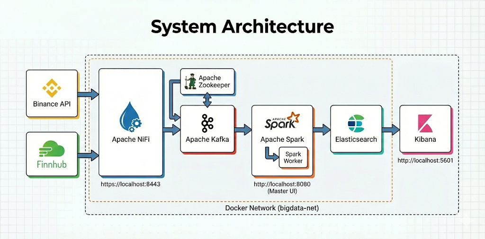
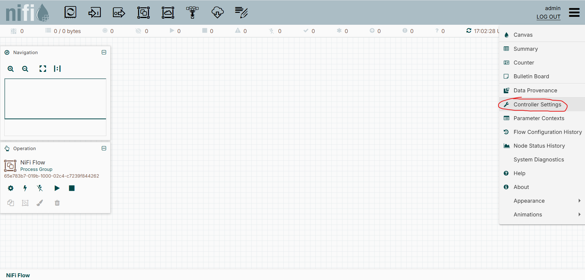
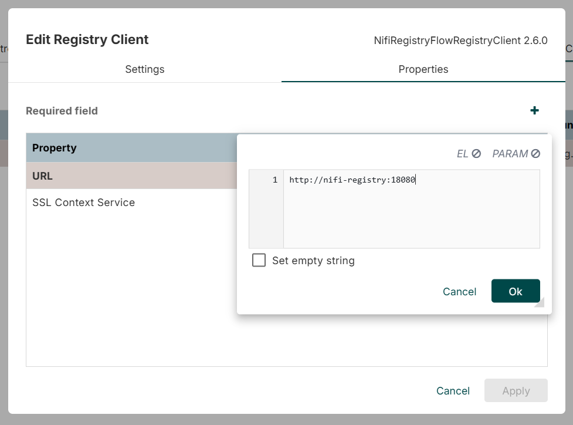
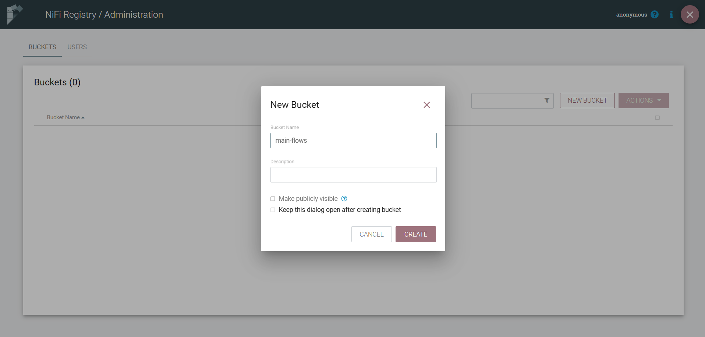
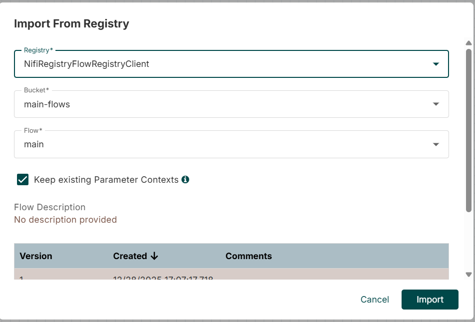
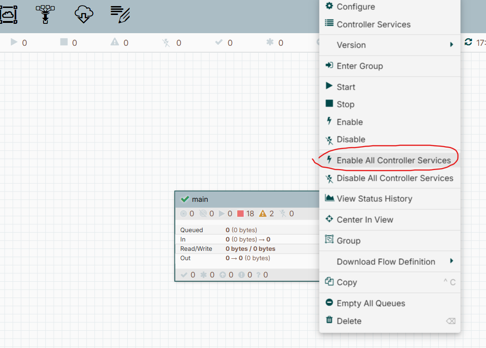
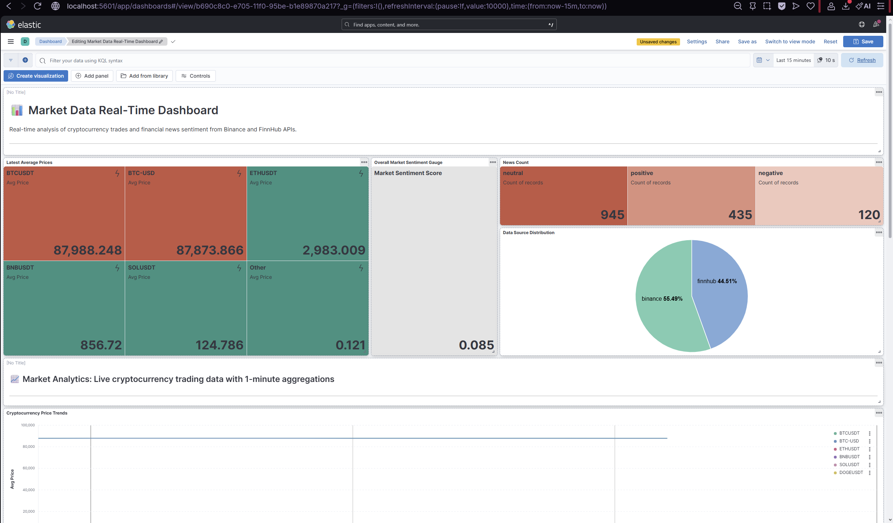
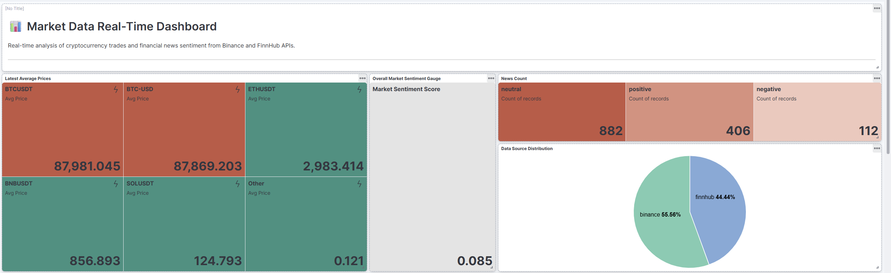
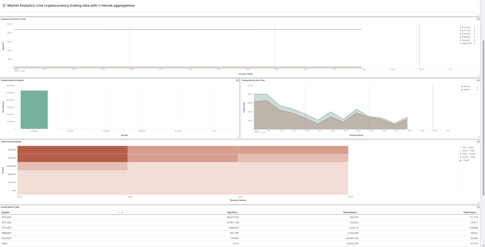
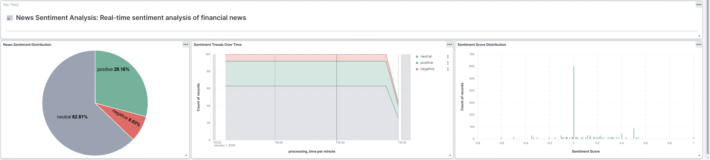

# Market Data Streaming and Visualization

A simple trades/news visualization app using:
- Apache NiFi for data ingestion from Binance and FinnHub APIs
- Apache Kafka for message queuing
- Spark Streaming for analytics and processing
- Elasticsearch for storage
- Kibana for visualization



----

# Quick Start

## Starting the Services
1. **Clone the Repository**
    ```bash
    git clone https://github.com/ilyasishere/market-data-streaming-viz.git
    cd market-data-streaming-viz
    ```
2. **Start Docker Containers**
    ```bash
    docker compose up -d
    ```
3. **Access the Services**
    - NiFi: `https://localhost:8443/nifi`
        - (login with `admin` / `password12345678`)
        - Make sure to use `https` protocol, as it won't work with `http`.
    - NiFi Registry: `http://localhost:18080/nifi-registry`
    - Kibana: `http://localhost:5601`


## Importing the NiFi Workflow

1. **Set Up NiFi Registry Client**
    - In NiFi, create a new `NifiRegistryFlowRegistryClient` under Controller Services.

    
    
    - Set the URL to `http://nifi-registry:18080`.

    


2. **Create a Bucket in NiFi Registry**
    - Open the Registry UI at `http://localhost:18080/nifi-registry`.
    - Go to Settings on the top right.
    - Create a bucket named `main-flows`.

    


3. **Import the Workflow**
    - On the Registry homepage, click **Import New Flow**.
    - Set the flow name to `main`.
    - Select the `main-flows` bucket.
    - Upload the `workflow.json` file as the Flow Definition.
    - Click **Import**.

    

4. **Deploy the Workflow in NiFi**
    - In the NiFi UI, drag the **Import from Registry** icon onto the canvas.

    
    - Select the `main-flows` bucket and the `main` flow.
    - Click **Import**.

    

5. **Enable and Start the Workflow**
    - Right-click the `main` process group you just imported.
    - Click **Enable all controller services**.

    

    - Right-click again and select **Start** to run the workflow.

    


## Launching the Spark Streaming Jobs

**Note**: Ensure all Docker services have fully started before proceeding. Check with `docker compose ps`.

The Spark jobs process cryptocurrency trades and news data, performing real-time analytics and sentiment analysis using TextBlob (a pre-trained NLP library for sentiment detection).

**Start both jobs:**

On Linux/Mac:
```bash
./start_processing.sh
```

On Windows:
```bash
bash ./start_processing.sh
```

The script launches two jobs:
- **Trades Analytics**: Calculates 1-minute window aggregations (avg price, volume, trade count)
- **News Sentiment**: Analyzes news articles for sentiment (positive/negative/neutral)

**Verify jobs are running:**

Check Spark UI at `http://localhost:8080` - both jobs should be running with 1 core each.

Wait 1-2 minutes for data to flow, then verify:
```bash
curl http://localhost:9200/market_prices/_count
curl http://localhost:9200/news_sentiment/_count
```

**Note**: Jobs process only new data, not historical. Wait 1-2 minutes after starting before checking.

## Visualizing Data in Kibana

**Import the Dashboard:**

1. Open Kibana at `http://localhost:5601`
2. Go to **☰** → **Management** → **Stack Management** → **Saved Objects**
3. Click **Import** and select `kibana_dashboard.ndjson`
4. If prompted, choose **Overwrite**
5. Navigate to **☰** → **Analytics** → **Dashboard** → **Market Data Real-Time Dashboard**

**Configure Time Range:**

Set the time range to **Last 15 minutes** and enable auto-refresh (10 seconds for example) in the top-right corner.

### Dashboard Overview



The dashboard provides real-time insights through three main sections:

**Key Metrics**



- Latest average prices for each cryptocurrency
- Overall market sentiment gauge (mean sentiment score from -1.0 to +1.0)
- News count by sentiment category
- Data source distribution

**Market Analytics**



- Cryptocurrency price trends over time
- Trading volume by symbol
- Trading activity timeline
- Trade activity heatmap
- Symbol metrics table (price, volume, trade count)

**News Sentiment Analysis**



- Sentiment distribution (positive/negative/neutral)
- Sentiment trends over time
- Sentiment score distribution histogram
