# Market Data Streaming and Visualization

A simple trades/news visualization app using:
- Apache NiFi for data ingestion from Binance and FinnHub APIs 
- Apache Kafka for message queuing
- Spark Streaming for analytics and processing
- Elasticsearch for storage 
- Kibana for visualization


----

# Quick Start

## Starting the Services
1. **Clone the Repository**
    ```bash
    git clone https://github.com/ilyasishere/market-data-streaming-viz.git
    cd market-data-streaming-viz
    ```
2. **Start Docker Containers**
    ```bash
    docker compose up -d
    ```
3. **Access the Services**
    - NiFi: `https://localhost:8080/nifi` 
        - (login with `admin` / `password12345678`)
        - Make sure to use `https` protocol, as it won't work with `http`.
    - NiFi Registry: `http://localhost:18080/nifi-registry`
    - Kibana: `http://localhost:5601`


## Importing the NiFi Workflow

1. **Set Up NiFi Registry Client**
    - In NiFi, create a new `NifiRegistryFlowRegistryClient` under Controller Services.

    
    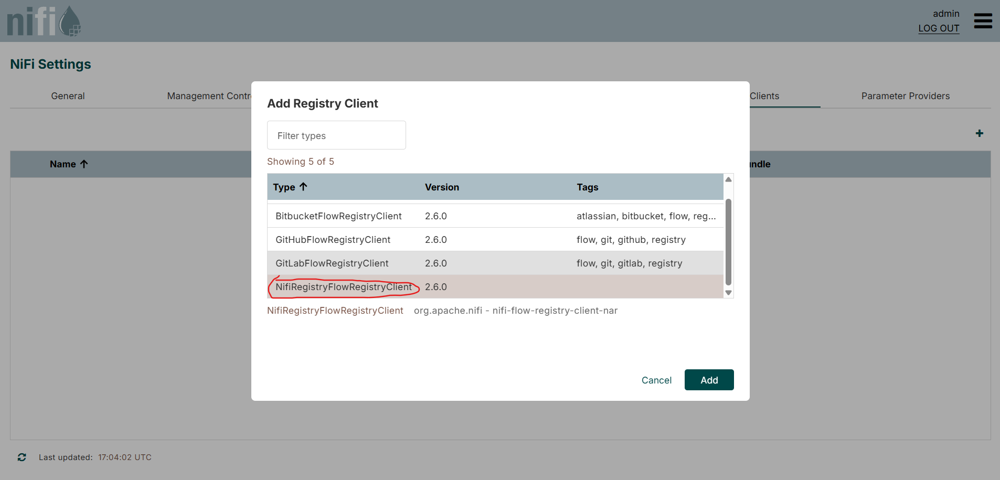
    - Set the URL to `http://nifi-registry:18080`.

    


2. **Create a Bucket in NiFi Registry**
    - Open the Registry UI at `http://localhost:18080/nifi-registry`.
    - Go to Settings on the top right.
    - Create a bucket named `main-flows`.

    


3. **Import the Workflow**
    - On the Registry homepage, click **Import New Flow**.
    - Set the flow name to `main`.
    - Select the `main-flows` bucket.
    - Upload the `workflow.json` file as the Flow Definition.
    - Click **Import**.

    

4. **Deploy the Workflow in NiFi**
    - In the NiFi UI, drag the **Import from Registry** icon onto the canvas.

    
    - Select the `main-flows` bucket and the `main` flow.
    - Click **Import**.

    

5. **Enable and Start the Workflow**
    - Right-click the `main` process group you just imported.
    - Click **Enable all controller services**.

    

    - Right-click again and select **Start** to run the workflow.

    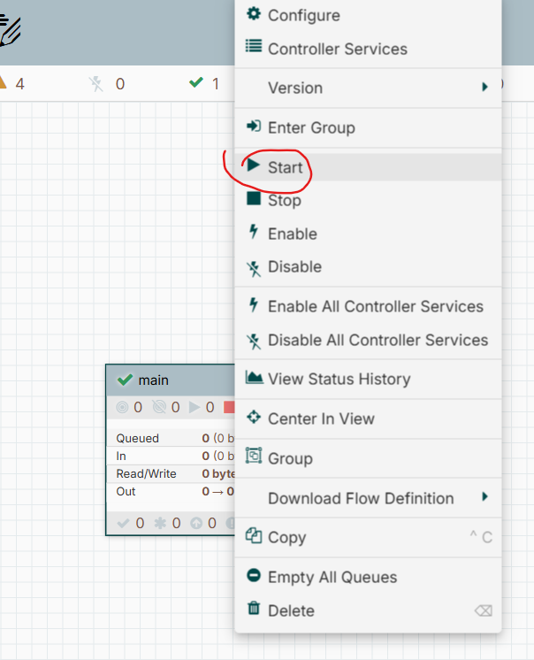


## Launching the Spark Streaming jobs

It's as easy as running the `start_processing.sh` script:

On Linux/Mac:
```bash
./start_processing.sh
``` 
On Windows:
```bash
bash ./start_processing.sh
```

## Visualizing Data in Kibana
TODO


----
# How It Works
## 1. Data Ingestion with NiFi 

NiFi fetches real-time trade data from Binance and news data from FinnHub APIs, then pushes this data into Kafka topics.

The image below shows the whole NiFi workflow. The workflow on the right is responsible for fetching trade data using websockets, while the left side handles news data fetching via REST API calls.

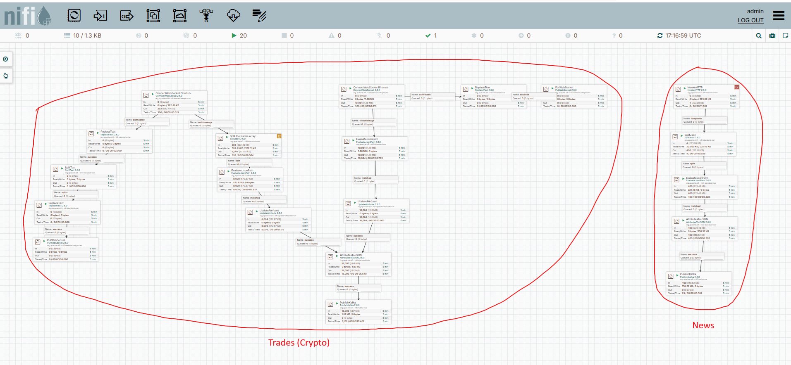

### Trades data

For the ConnectWebSocket processor to work, we need to create a Jetty WebSocketClient Service. We then configure the WebSocket URI property to point to the FinnHub trades stream endpoint, with the API key:

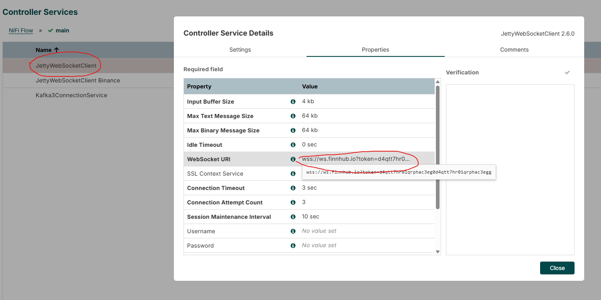

The left-most path sends a subscription message to the FinnHub API to start receiving trades data for the symbols we specified.

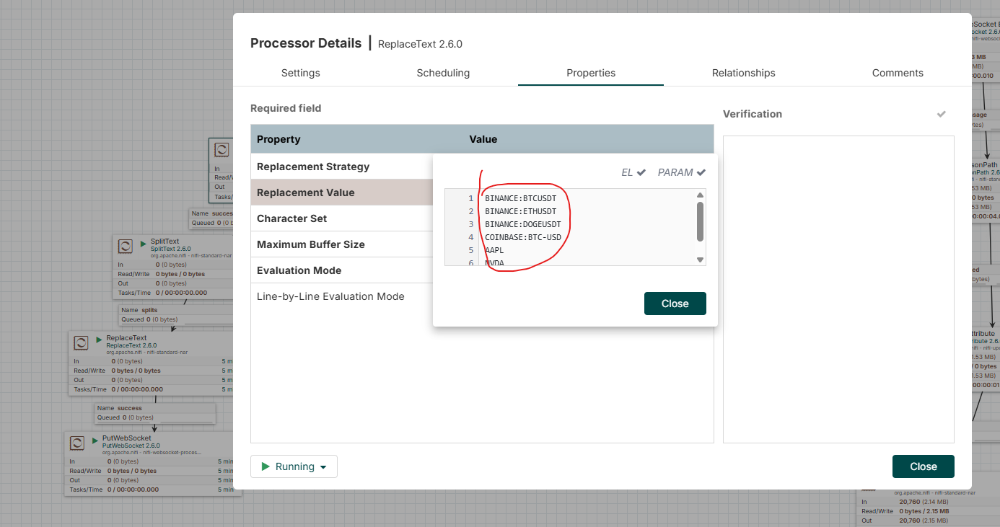

The path next to it receives the incoming trades data, splits the JSON array into individual messages (because FinnHub sends trades in batches), then renames the attributes (e.g. changing "p" to "price") for better readability. Finally, the output is converted back into a json and is published to the Kafka topic `financial_trades`, using the PublishKafka NiFi processor and a Kafka3ConnectionService.

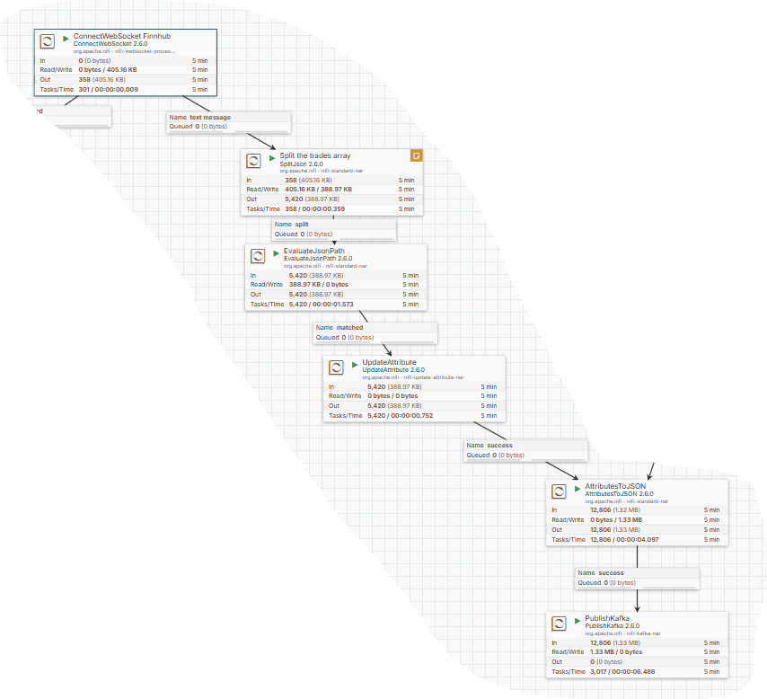
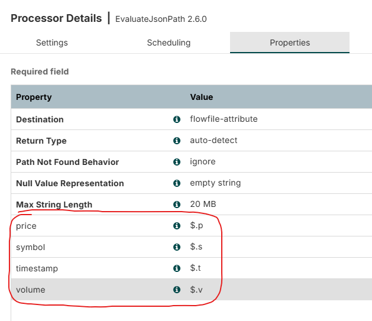

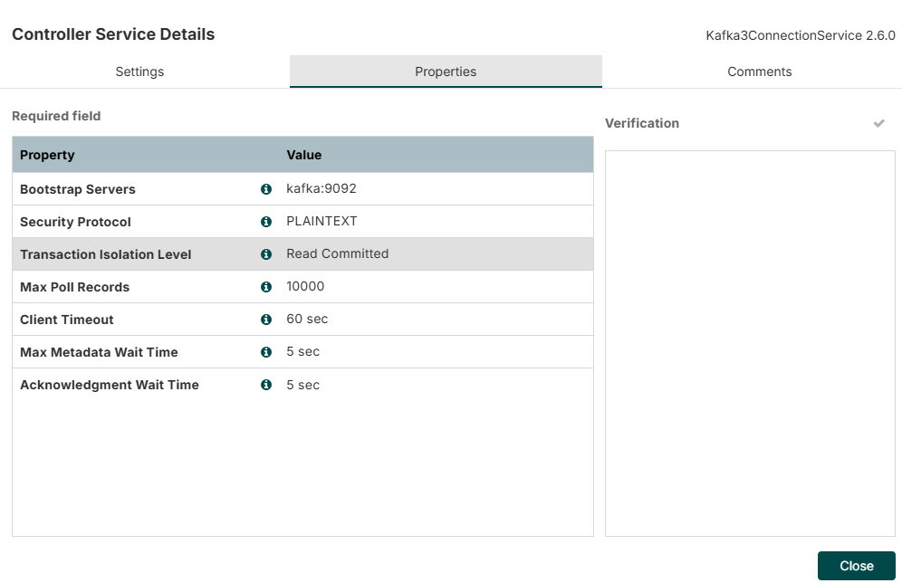
*Kafka3ConnectionService configuration*

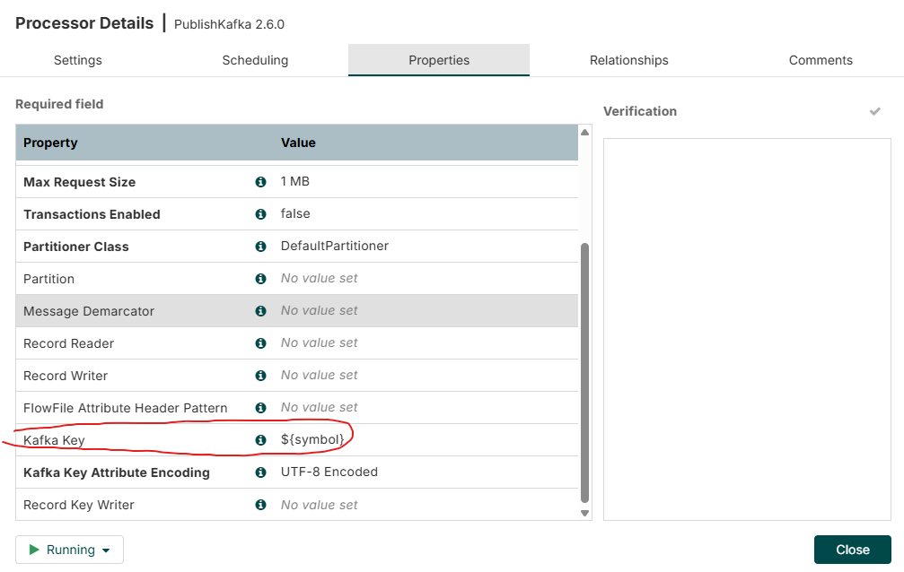
*PublishKafka processor configuration: we use the trade `symbol` as the Kafka Key*


  
*PublishKafka processor configuration: setting `financial_trades` as the Kafka Topic*

**Note:**
The same thing goes for the Binance API, except that it uses a different WebSocket endpoint and different message format.


### News data

The news data ingestion flow is simpler, as it uses REST API calls every 60 seconds instead of websockets.

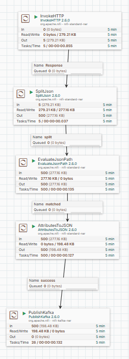

We use the InvokeHTTP NiFi processor to call the FinnHub news endpoint, setting the API key and other parameters in the URL:

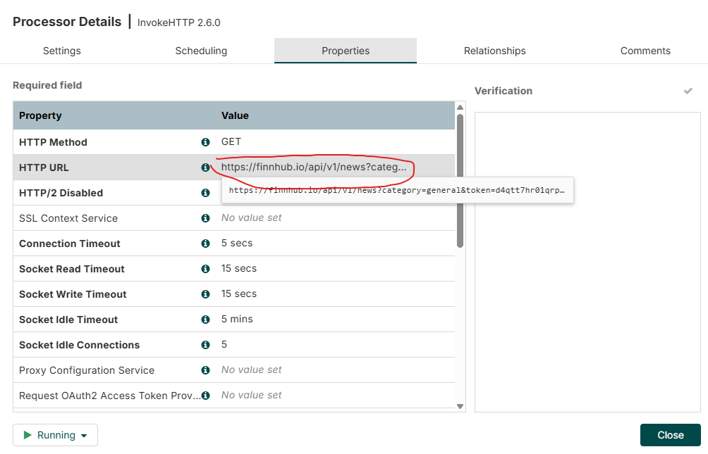

We set the scheduler to run every 1 minute:

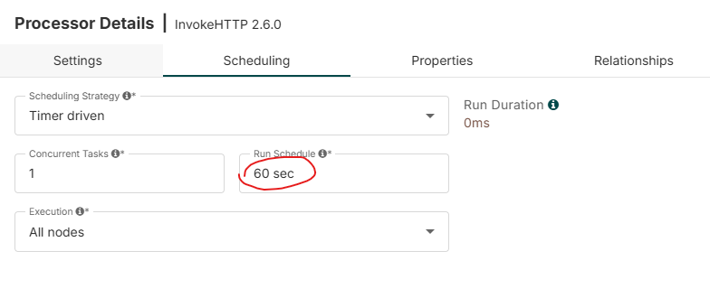

Then, the SplitJson processor splits the returned JSON array of news articles into individual messages, using the JsonPath expression `$`:


After that, we rename some attributes (e.g. url to article_url):

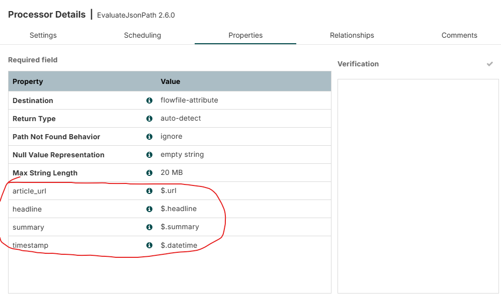

Then, we set the schema and convert the data back to JSON format using the AttributesToJson processor:

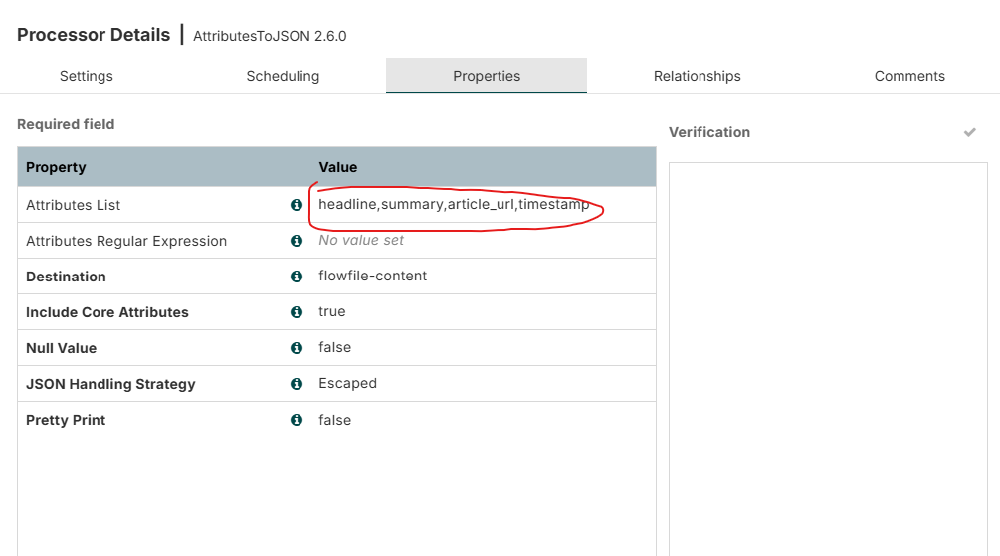

Finally, we publish the news data to the Kafka topic `financial_news` using the PublishKafka processor:

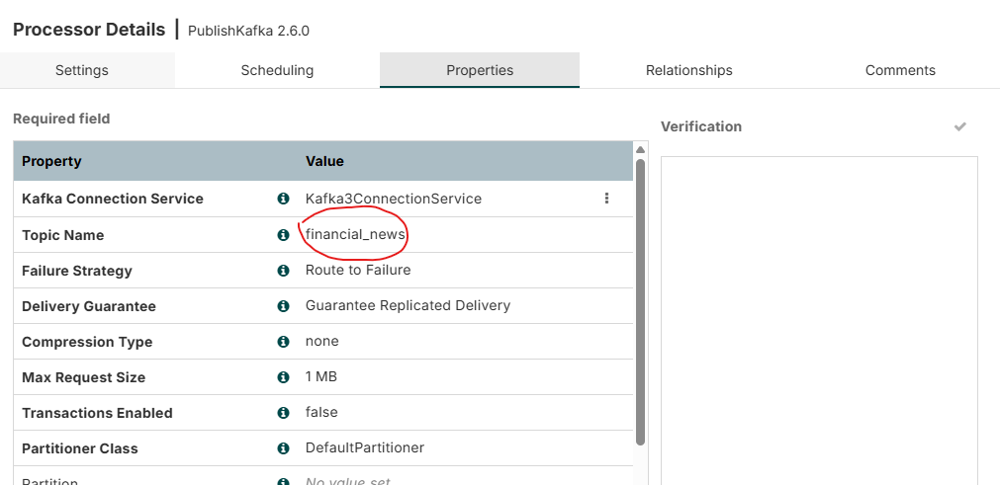


## 2. Data Processing with Spark Streaming